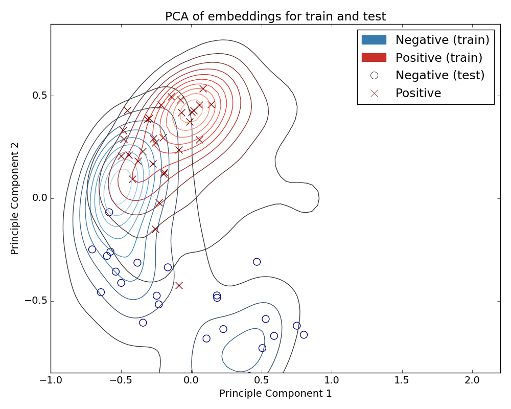

# Code for training and evaluating earthquake prediction models.

## Environment setup

Install Anaconda3 (Python3) with the following command on an Ubuntu machine:

```
wget --quiet https://repo.anaconda.com/archive/Anaconda3-5.2.0-Linux-x86_64.sh -O ~/anaconda.sh && \
    /bin/bash ~/anaconda.sh -b -p 
```

1. Make an environment: `conda create -n earthquake` 
2. Activate it: `source activate earthquake`
3. Install the requirements: `pip install -r requirements.txt`

For quick training you will also need an NVIDIA card and CUDA set up so PyTorch can use 
GPUs for training.

## Preparing the data

The data should be kept in a directory structure as follows:

```
data_folder/
    earthquake1/
        positive/
            file1.sac
            file2.sac
            ...
        negative/
            file1.sac
            file2.sac
            ...
        more_optional_labels_like_chaos/
            more_files.sac
            ...
    earthquake2/
        positive/
            file1.sac
            file2.sac
            ...
        negative/
            file1.sac
            file2.sac
            ...
        more_optional_labels_like_chaos/
            more_files.sac
            ...
    ...
```

The script `prepare_data.py` will take in a path to a directory that looks like above 
and then process them into pickled files that can be trained off of easily. The script
also resamples the earthquakes to 20 Hz. Here's the help text of the script:

```
usage: prepare_data.py [-h] --output_directory OUTPUT_DIRECTORY
                       --dataset_directory DATASET_DIRECTORY
                       [--accepted_labels ACCEPTED_LABELS]

optional arguments:
  -h, --help            show this help message and exit
  --output_directory OUTPUT_DIRECTORY
                        Processed earthquake files get stored here in pickle
                        files.
  --dataset_directory DATASET_DIRECTORY
                        Raw earthquake files get stored here. The folder
                        should have subfolders for each earthquake. Those
                        subfolders should contain subfolders with SAC files
                        with the subfolder name being the label of the
                        earthquake (e.g. /folder/earthquake_name/positive,
                        /folder/earthquake_name/negative
  --accepted_labels ACCEPTED_LABELS
                        Labels to use for training, delineated by : (e.g.
                        positive:negative:chaos). Defaults to
                        positive:negative.
```

Give it an output directory and the files will be populated there. Accepted labels lets you
ignore some folders (e.g. earthquake categories where you are unsure of their label) 
Here's an example usage:

```
python prepare_data.py 
    --dataset_directory ../data/raw/trigger 
    --output_directory ../data/prepared/trigger
    --accepted_labels positive:negative
```

This will take in the earthquakes in ../data/raw/trigger, use only the ones that have
positive or negative as their label (ignoring chaos, for example), and put the processed
earthquakes into ../data/prepared/trigger.

## Training the model
The training code is in `train.py`. This script takes in a bunch of arguments and trains
the model accordingly. Here's the help text for that script:

```
usage: train.py [-h] [--output_directory OUTPUT_DIRECTORY]
                [--dataset_directory DATASET_DIRECTORY]
                [--model_type MODEL_TYPE] [--batch_size BATCH_SIZE]
                [--num_workers NUM_WORKERS] [--num_epochs NUM_EPOCHS]
                [--transforms TRANSFORMS] [--augmentations AUGMENTATIONS]
                [--length LENGTH] [--sample_strategy SAMPLE_STRATEGY]
                [--training_strategy TRAINING_STRATEGY] [--split SPLIT]
                [--learning_rate LEARNING_RATE]
                [--embedding_size EMBEDDING_SIZE]
                [--weight_decay WEIGHT_DECAY] [--loss_function {dpcl,cl}]

optional arguments:
  -h, --help            show this help message and exit
  --output_directory OUTPUT_DIRECTORY
                        Where the files produced during training go (e.g.
                        model checkpoints).
  --dataset_directory DATASET_DIRECTORY
                        Path to directory containing the dataset to train
                        from.
  --model_type MODEL_TYPE
                        What type of model ot use. Options are 'fc', which is
                        a fully connected network and 'conv' which is a
                        convolutional neural network.
  --batch_size BATCH_SIZE
                        Batch size for training the model. Defaults to 40
  --num_workers NUM_WORKERS
                        Number of workers to use for generating the dataset.
                        Defaults to 1. Increase for more training efficiency.
  --num_epochs NUM_EPOCHS
                        Number of epochs (passes through the data) to train
                        for. Defaults to 40.
  --transforms TRANSFORMS
                        Transforms to apply to the data, separated by colons
                        (e.g. demean:raw). Options are demean, raw, lowpass,
                        bandpass, and whiten. Can be combined using colons.
                        lowpass, bandpass, raw are applied to the original
                        data and is concatenated together. See dataset.py for
                        details.
  --augmentations AUGMENTATIONS
                        Augment the data on the fly. Two options: 'amplitude'
                        and 'noise'. Amplitude makes the input get louder or
                        quieter over the course of the seismogram. Noise adds
                        a bit of a Gaussian noise to the input. Both are done
                        randomly.
  --length LENGTH       The seismogram is cropped randomly during training.
                        This decides the number of samples to use.
  --sample_strategy SAMPLE_STRATEGY
                        How to go through the training data each epoch.
                        Options are sequential and random.
  --training_strategy TRAINING_STRATEGY
                        Training strategy for the model. Either use siamese
                        training or don't. Probably don't change this from
                        'siamese', which it defaults to.
  --split SPLIT         This takes in a string that identifies the earthquake
                        that will be used for testing. The string should be
                        the same as the name of the folder containing the
                        earthquake.
  --learning_rate LEARNING_RATE
                        Learning rate for training. Defaults to 2e-5.
  --embedding_size EMBEDDING_SIZE
                        Embedding size for the model. Each earthquake
                        seismogram is projected to an embedding space of this
                        size. Defaults to 10.
  --weight_decay WEIGHT_DECAY
                        L2 regularization of the model. Adjust to be higher if
                        model is overfitting.
  --loss_function {dpcl,cl}
                        Loss function to train model with. Can be 'dpcl', deep
                        clustering loss, or 'cl', contrastive loss.
                        Contrastive loss is not tested and may not work.
```

The most important part here is the "split" argument. This lets you decide which 
earthquake will be used for testing. The remaining earthquakes will be used for 
training. For example, given the directory structure from the previous section, if I
wanted to train the model on earthquake1 and test it on earthquake2, I would pass
`--split earthquake2` to `train.py`. Here's an example usage of the script:

```
python train.py \
    --model_type "conv" \
    --output_directory "models/run0" \
    --dataset_directory "../data/prepared/trigger/" \
    --batch_size 64 \
    --num_workers 10 \
    --num_epochs 100 \
    --transforms "bandpass:whiten" \
    --augmentations "amplitude:noise" \
    --length 8192 \
    --sample_strategy "sequential" \
    --learning_rate 2e-5 \
    --weight_decay 1e-1 \
    --split SAC_20021102_XF_prem \
    --embedding_size 10 \
    --loss_function "dpcl"
```

This will train a convolutional neural network with an embedding size of 10 (mapping each
seismogram to a 10-dimensional space). It will train with a deep clustering loss function
using a learning rate of 2e-5, L2 regularization of 1e-1 and a batch size of 64 for 100
epochs. The data will be bandpassed and whitened to have unit variance and zero mean before
being passed to the model. The data will be augmented on the fly, adding noise and amplitude
variation. The data will be presented to the network in the same order every time 
(sample_strategy is sequential). Finally, the network will be trained on all earthquakes
except for SAC_20021102_XF_prem. This last earthquake will be used for testing.

## Testing the model

The testing script is in `test.py`. This script is easy to use, simply point it at the
output_directory you used in `train.py`. For example:

```
python test.py
    --output_directory "models/run0"
```

The testing results will be output by the script into that directory. You'll see 3 files:

1. `results.txt` gives the confusion matrix and a bunch of evaluation measures on the data.
2. `tr_viz.png` visualizes the training space.
3. `tt_viz.png` does the same visualization for the testing space.
4. `combined.png` visualizes the testing data on top of the training data with a KDE plot and scatter plot.

For the split used in the examples here on the triggered earthquake detection task, I get:

```
Predict          0     1     
Actual
0                25    0     

1                4     27    

```

And the visualization looks like:

Inline-style: 


Example training script is in code/example_scripts/train.sh.

That's it! Hopefully it works.